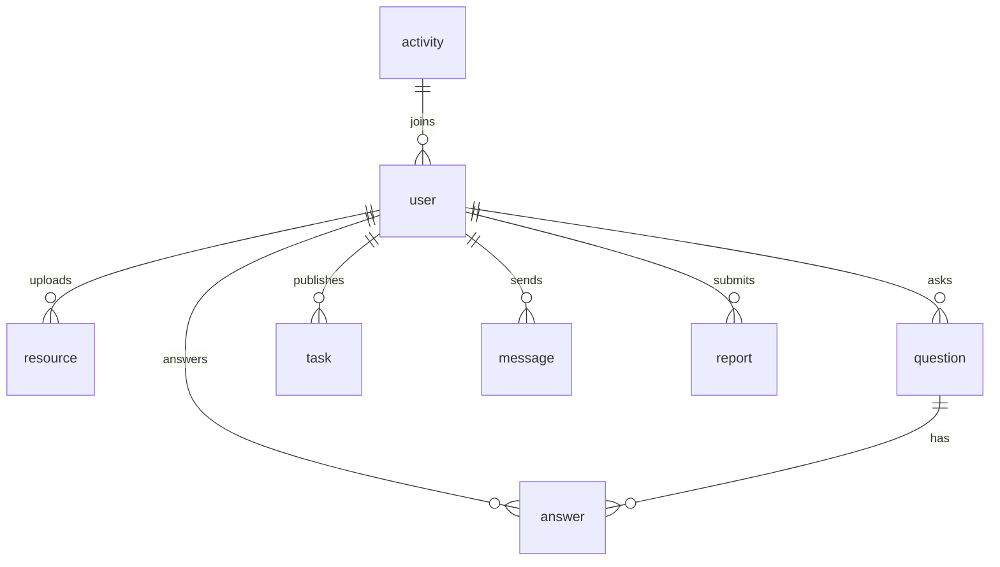

# CampusLink（高校资源互助与问答平台）——多端统一开发方案（方案 A：uni-app 全端架构）

> 目标：打造一个可在 **微信小程序 + Android + iOS + 鸿蒙元服务** 同步运行的高校互助问答与资源共享平台，统一代码、统一服务、统一数据。

---

## 一、项目定位

**一句话定义**：
面向大学校园的多端互助学习平台，集课程资料共享、智能问答、互助任务与社团活动于一体。

**应用端覆盖**：

* 微信小程序（主渠道）
* Android / iOS APP（uni-app App 端打包）
* 鸿蒙系统（HarmonyOS Next 元服务包）
* Web H5 端（统一调试与桌面使用）

---

## 二、系统目标与价值

1. **统一开发**：前端基于 uni-app（Vue3 语法 + uView 组件库），一次开发多端发布。
2. **实时交互**：WebSocket 实现问答、消息、任务状态的实时刷新。
3. **智能问答**：FastAPI + GPT 模型服务，生成“智能参考答案”。
4. **激励体系**：积分与等级系统，形成“学习经济”闭环。
5. **校园生态**：支持社团活动、资料共享、互助任务，促进校园交流。

---

## 三、总体架构

**技术架构分层图（文字版）**：

```
[Client: uni-app (WeChat MiniProgram / App / Harmony / H5)]
   ↓ REST / WebSocket
[Spring Boot Backend]
   ↓ HTTP RPC
[FastAPI AI Service] —— 调用 GPT / Claude 接口生成智能答复
   ↓
[MySQL + Redis + OSS + Elasticsearch]
```

**核心技术栈**：

| 模块    | 技术选型                                         |
| ----- | -------------------------------------------- |
| 前端    | uni-app (Vue3 + uView + Pinia + Vite)        |
| 后端    | Spring Boot 3 + MyBatis Plus + JWT + Swagger |
| 搜索    | Elasticsearch 8（问答、资源搜索）                     |
| AI 服务 | Python FastAPI + LangChain + GPT API         |
| 数据库   | MySQL 8 + Redis 缓存                           |
| 文件存储  | 阿里云 OSS（课程资料、图片）                             |
| 实时通信  | Spring WebSocket / uni-socket-adapter        |
| 部署    | Nginx + Docker + Jenkins CI/CD               |

---

## 四、功能模块

### 1. 用户与认证系统

* 注册、登录（学号、邮箱、手机号）
* JWT 统一鉴权；小程序端使用 WeChat 登录态；App 端手机号登录。
* 用户积分、等级、认证（学生证照片审核）。

### 2. 资源共享模块

* 上传资料（课件、试题、笔记等），自动识别分类。
* 审核系统：AI 自动检测重复与违规内容。
* 下载与积分结算机制：上传得分、下载消费积分。

### 3. 问答模块

* 用户提问、他人回答、点赞、采纳。
* FastAPI 调用 GPT 自动生成智能答复，带“AI 参考答案”标签。
* 回答内容存储于 Elasticsearch，支持全文检索。

### 4. 校园互助任务

* 悬赏任务发布与接单（跑腿、借书、代签、组队）。
* 实时任务状态更新（WebSocket 通知）。
* 任务积分结算，异常申诉与仲裁模块。

### 5. 社团与活动

* 社团主页：成员管理、活动发布。
* 活动报名与签到；积分奖励机制。
* 校园活动公告流。

### 6. 智能推荐系统

* Elasticsearch + 协同过滤推荐（基于浏览、下载、提问历史）。
* GPT 自动生成“相关推荐卡片”和“知识小结”。

### 7. 后台管理系统

* 用户与资源管理、积分调整。
* 举报与内容审核面板。
* 系统日志与访问量统计（Grafana 可选）。

---

## 五、数据库设计（核心表）

```
user(u_id, nickname, email, phone, password_hash, role, points, level, created_at)
resource(r_id, title, uploader_id, url, category, score, downloads, status, created_at)
question(q_id, title, content, asker_id, ai_answer, created_at)
answer(a_id, q_id, responder_id, content, likes, accepted)
task(t_id, publisher_id, content, reward, status, deadline)
message(m_id, sender_id, receiver_id, content, is_read, send_time)
activity(act_id, club_id, title, time, location, description)
report(rep_id, reporter_id, target_id, type, reason, status)
```

**ER 图（Mermaid）**：



---

## 六、接口设计（REST + WebSocket）

### Spring Boot API（REST）

* `POST /api/auth/login` 登录（多端兼容）
* `GET /api/user/profile` 用户资料
* `POST /api/resource/upload` 上传资源
* `GET /api/resource/search?q=...` 搜索资源
* `POST /api/question/create` 创建问题
* `GET /api/question/{id}` 获取问题详情（含 AI 答复）
* `POST /api/task/publish` 发布任务
* `GET /api/task/nearby` 获取附近任务列表（按学校定位）
* `GET /api/activity/list` 获取活动公告

### WebSocket 通信

* `/ws/chat/{uid}` 用户消息频道
* `/ws/notify/{uid}` 系统推送（任务更新、评论提醒）

### FastAPI 服务

* `POST /ai/answer` 输入问题文本 → 返回 GPT 智能答复
* `POST /ai/similar` 输入关键词 → 返回相关资源与问题推荐

---

## 七、前端目录结构（uni-app）

```
CampusLink/
├─ pages/
│  ├─ index/               # 首页：公告、推荐、热榜
│  ├─ resource/            # 资料区
│  ├─ question/            # 问答区
│  ├─ task/                # 互助任务
│  ├─ activity/            # 社团活动
│  ├─ chat/                # 消息中心（WebSocket）
│  └─ profile/             # 用户中心
├─ store/                  # Pinia 状态管理
├─ utils/                  # 网络请求、WebSocket 适配、OSS 上传
├─ components/             # 通用组件（资源卡片、AI 答复卡）
└─ manifest.json           # 多端配置（小程序/APP/鸿蒙）
```

---

## 八、多端适配要点

### 1. 微信小程序

* 登录：`uni.login + code2Session`，后端换取 JWT。
* 推送：微信订阅消息。
* 文件上传：临时签名直传 OSS。

### 2. Android / iOS（App 端）

* 打包：HBuilderX → DCloud 云打包。
* 推送：FCM / APNs。
* 登录：手机号 + 短信验证码。

### 3. 鸿蒙元服务（HarmonyOS Next）

* 通过 `uniapp-harmony` 构建元服务应用包。
* 登录：华为账户（OAuth）。
* 推送：华为 Push Kit。

### 4. H5 端

* JWT 鉴权 + PWA 支持。
* 用于桌面浏览与调试。

---

## 九、开发计划（6 周）

| 周次  | 目标                   |
| --- | -------------------- |
| 第1周 | 数据库与后端接口设计；登录注册完成    |
| 第2周 | 资料共享模块（上传/搜索）        |
| 第3周 | 问答模块 + AI 智能答复接口     |
| 第4周 | 互助任务与消息系统（WebSocket） |
| 第5周 | 社团活动与后台管理功能          |
| 第6周 | 多端打包与测试（小程序、App、鸿蒙）  |

---

## 十、答辩亮点与创新

1. **多端统一**：uni-app 一套代码全端发布。
2. **AI 辅助问答**：GPT 自动答复、知识总结。
3. **实时通信**：任务与消息双向推送。
4. **校园闭环生态**：学习 + 互助 + 社团 + 激励体系。
5. **可演示性强**：移动端界面友好、功能可跑通。

---

## 十一、可扩展方向

* 小程序端接入 OCR 自动识别上传文档内容。
* GPT 模型接入本地校园资料微调（私有知识库）。
* 引入区块链积分凭证，保障积分真实性。

---

## 十二、隐私与合规声明

> 本系统仅供教育与科研用途，不涉及真实金融交易与商业推广；所有数据加密存储，用户信息遵守《个人信息保护法》。

---

## 十三、交付物与展示清单

1. 技术报告 + 论文文档（系统架构、实验结果）
2. 项目源码 + 部署文档 + Docker Compose
3. 演示视频（多端运行演示）
4. 答辩 PPT（功能展示 + 技术亮点 + 实验数据）
