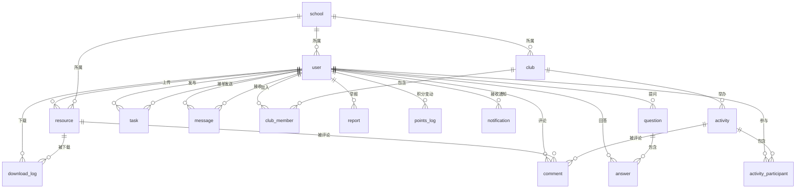

# CampusLink 数据库设计文档

## 一、数据库概述

- **数据库类型**：MySQL 8.0+
- **字符集**：utf8mb4
- **排序规则**：utf8mb4_unicode_ci
- **存储引擎**：InnoDB
- **时区**：Asia/Shanghai

---

## 二、核心表设计

### 1. 用户表 (user)

**表名**：`user`  
**说明**：存储用户基本信息、积分、等级等

| 字段名 | 类型 | 长度 | 允许NULL | 默认值 | 说明 |
|--------|------|------|----------|--------|------|
| u_id | BIGINT | - | NO | AUTO_INCREMENT | 用户ID（主键） |
| username | VARCHAR | 50 | NO | - | 用户名（唯一） |
| nickname | VARCHAR | 50 | NO | - | 昵称 |
| email | VARCHAR | 100 | YES | NULL | 邮箱（唯一） |
| phone | VARCHAR | 20 | YES | NULL | 手机号（唯一） |
| password_hash | VARCHAR | 255 | NO | - | 密码哈希（BCrypt） |
| avatar_url | VARCHAR | 500 | YES | NULL | 头像URL |
| student_id | VARCHAR | 50 | YES | NULL | 学号 |
| school_id | BIGINT | - | YES | NULL | 所属学校ID |
| major | VARCHAR | 100 | YES | NULL | 专业 |
| grade | INT | - | YES | NULL | 年级 |
| role | ENUM | - | NO | 'student' | 角色：student/teacher/admin |
| points | INT | - | NO | 0 | 积分 |
| level | INT | - | NO | 1 | 等级 |
| status | TINYINT | - | NO | 1 | 状态：0-禁用，1-正常 |
| is_verified | TINYINT | - | NO | 0 | 是否实名认证：0-否，1-是 |
| last_login_time | DATETIME | - | YES | NULL | 最后登录时间 |
| created_at | DATETIME | - | NO | CURRENT_TIMESTAMP | 创建时间 |
| updated_at | DATETIME | - | NO | CURRENT_TIMESTAMP ON UPDATE | 更新时间 |

**索引**：
- PRIMARY KEY (`u_id`)
- UNIQUE KEY `uk_username` (`username`)
- UNIQUE KEY `uk_email` (`email`)
- UNIQUE KEY `uk_phone` (`phone`)
- KEY `idx_school_id` (`school_id`)
- KEY `idx_status` (`status`)

---

### 2. 学校表 (school)

**表名**：`school`  
**说明**：学校信息表

| 字段名 | 类型 | 长度 | 允许NULL | 默认值 | 说明 |
|--------|------|------|----------|--------|------|
| school_id | BIGINT | - | NO | AUTO_INCREMENT | 学校ID（主键） |
| school_name | VARCHAR | 200 | NO | - | 学校名称 |
| province | VARCHAR | 50 | NO | - | 省份 |
| city | VARCHAR | 50 | NO | - | 城市 |
| address | VARCHAR | 500 | YES | NULL | 详细地址 |
| logo_url | VARCHAR | 500 | YES | NULL | 学校Logo |
| status | TINYINT | - | NO | 1 | 状态：0-禁用，1-正常 |
| created_at | DATETIME | - | NO | CURRENT_TIMESTAMP | 创建时间 |

**索引**：
- PRIMARY KEY (`school_id`)
- KEY `idx_city` (`city`)

---

### 3. 资源表 (resource)

**表名**：`resource`  
**说明**：课程资料、文档等资源

| 字段名 | 类型 | 长度 | 允许NULL | 默认值 | 说明 |
|--------|------|------|----------|--------|------|
| r_id | BIGINT | - | NO | AUTO_INCREMENT | 资源ID（主键） |
| title | VARCHAR | 200 | NO | - | 资源标题 |
| description | TEXT | - | YES | NULL | 资源描述 |
| uploader_id | BIGINT | - | NO | - | 上传者ID |
| file_url | VARCHAR | 500 | NO | - | 文件URL（OSS） |
| file_name | VARCHAR | 255 | NO | - | 原始文件名 |
| file_size | BIGINT | - | NO | 0 | 文件大小（字节） |
| file_type | VARCHAR | 50 | NO | - | 文件类型（pdf/doc/ppt等） |
| category | VARCHAR | 50 | NO | - | 分类（课件/试题/笔记等） |
| course_name | VARCHAR | 100 | YES | NULL | 课程名称 |
| school_id | BIGINT | - | YES | NULL | 所属学校ID |
| score | INT | - | NO | 0 | 所需积分 |
| downloads | INT | - | NO | 0 | 下载次数 |
| likes | INT | - | NO | 0 | 点赞数 |
| status | TINYINT | - | NO | 0 | 状态：0-待审核，1-已通过，2-已拒绝 |
| reject_reason | VARCHAR | 500 | YES | NULL | 拒绝原因 |
| created_at | DATETIME | - | NO | CURRENT_TIMESTAMP | 创建时间 |
| updated_at | DATETIME | - | NO | CURRENT_TIMESTAMP ON UPDATE | 更新时间 |

**索引**：
- PRIMARY KEY (`r_id`)
- KEY `idx_uploader_id` (`uploader_id`)
- KEY `idx_category` (`category`)
- KEY `idx_school_id` (`school_id`)
- KEY `idx_status` (`status`)
- KEY `idx_created_at` (`created_at`)
- FULLTEXT KEY `ft_title_desc` (`title`, `description`)

---

### 4. 问题表 (question)

**表名**：`question`  
**说明**：用户提问

| 字段名 | 类型 | 长度 | 允许NULL | 默认值 | 说明 |
|--------|------|------|----------|--------|------|
| q_id | BIGINT | - | NO | AUTO_INCREMENT | 问题ID（主键） |
| title | VARCHAR | 200 | NO | - | 问题标题 |
| content | TEXT | - | NO | - | 问题内容 |
| asker_id | BIGINT | - | NO | - | 提问者ID |
| category | VARCHAR | 50 | YES | NULL | 分类（学习/生活/技术等） |
| tags | VARCHAR | 500 | YES | NULL | 标签（JSON数组字符串） |
| images | TEXT | - | YES | NULL | 图片URL列表（JSON数组） |
| ai_answer | TEXT | - | YES | NULL | AI生成的答案 |
| ai_generated_at | DATETIME | - | YES | NULL | AI答案生成时间 |
| views | INT | - | NO | 0 | 浏览次数 |
| answer_count | INT | - | NO | 0 | 回答数量 |
| is_solved | TINYINT | - | NO | 0 | 是否已解决：0-否，1-是 |
| reward_points | INT | - | NO | 0 | 悬赏积分 |
| status | TINYINT | - | NO | 1 | 状态：0-已删除，1-正常 |
| created_at | DATETIME | - | NO | CURRENT_TIMESTAMP | 创建时间 |
| updated_at | DATETIME | - | NO | CURRENT_TIMESTAMP ON UPDATE | 更新时间 |

**索引**：
- PRIMARY KEY (`q_id`)
- KEY `idx_asker_id` (`asker_id`)
- KEY `idx_category` (`category`)
- KEY `idx_is_solved` (`is_solved`)
- KEY `idx_created_at` (`created_at`)
- FULLTEXT KEY `ft_title_content` (`title`, `content`)

---

### 5. 回答表 (answer)

**表名**：`answer`  
**说明**：问题的回答

| 字段名 | 类型 | 长度 | 允许NULL | 默认值 | 说明 |
|--------|------|------|----------|--------|------|
| a_id | BIGINT | - | NO | AUTO_INCREMENT | 回答ID（主键） |
| q_id | BIGINT | - | NO | - | 问题ID |
| responder_id | BIGINT | - | NO | - | 回答者ID |
| content | TEXT | - | NO | - | 回答内容 |
| images | TEXT | - | YES | NULL | 图片URL列表（JSON数组） |
| likes | INT | - | NO | 0 | 点赞数 |
| is_accepted | TINYINT | - | NO | 0 | 是否被采纳：0-否，1-是 |
| status | TINYINT | - | NO | 1 | 状态：0-已删除，1-正常 |
| created_at | DATETIME | - | NO | CURRENT_TIMESTAMP | 创建时间 |
| updated_at | DATETIME | - | NO | CURRENT_TIMESTAMP ON UPDATE | 更新时间 |

**索引**：
- PRIMARY KEY (`a_id`)
- KEY `idx_q_id` (`q_id`)
- KEY `idx_responder_id` (`responder_id`)
- KEY `idx_is_accepted` (`is_accepted`)
- KEY `idx_created_at` (`created_at`)

---

### 6. 任务表 (task)

**表名**：`task`  
**说明**：校园互助任务

| 字段名 | 类型 | 长度 | 允许NULL | 默认值 | 说明 |
|--------|------|------|----------|--------|------|
| t_id | BIGINT | - | NO | AUTO_INCREMENT | 任务ID（主键） |
| publisher_id | BIGINT | - | NO | - | 发布者ID |
| title | VARCHAR | 200 | NO | - | 任务标题 |
| content | TEXT | - | NO | - | 任务描述 |
| task_type | VARCHAR | 50 | NO | - | 任务类型（跑腿/借书/代签/组队） |
| reward_points | INT | - | NO | 0 | 悬赏积分 |
| location | VARCHAR | 200 | YES | NULL | 地点 |
| deadline | DATETIME | - | YES | NULL | 截止时间 |
| accepter_id | BIGINT | - | YES | NULL | 接单者ID |
| status | TINYINT | - | NO | 0 | 状态：0-待接单，1-进行中，2-已完成，3-已取消 |
| images | TEXT | - | YES | NULL | 图片URL列表（JSON数组） |
| created_at | DATETIME | - | NO | CURRENT_TIMESTAMP | 创建时间 |
| updated_at | DATETIME | - | NO | CURRENT_TIMESTAMP ON UPDATE | 更新时间 |
| completed_at | DATETIME | - | YES | NULL | 完成时间 |

**索引**：
- PRIMARY KEY (`t_id`)
- KEY `idx_publisher_id` (`publisher_id`)
- KEY `idx_accepter_id` (`accepter_id`)
- KEY `idx_task_type` (`task_type`)
- KEY `idx_status` (`status`)
- KEY `idx_deadline` (`deadline`)

---

### 7. 消息表 (message)

**表名**：`message`  
**说明**：用户私信

| 字段名 | 类型 | 长度 | 允许NULL | 默认值 | 说明 |
|--------|------|------|----------|--------|------|
| m_id | BIGINT | - | NO | AUTO_INCREMENT | 消息ID（主键） |
| sender_id | BIGINT | - | NO | - | 发送者ID |
| receiver_id | BIGINT | - | NO | - | 接收者ID |
| content | TEXT | - | NO | - | 消息内容 |
| msg_type | TINYINT | - | NO | 1 | 消息类型：1-文本，2-图片，3-文件 |
| file_url | VARCHAR | 500 | YES | NULL | 文件URL（如果是文件消息） |
| is_read | TINYINT | - | NO | 0 | 是否已读：0-未读，1-已读 |
| read_at | DATETIME | - | YES | NULL | 阅读时间 |
| created_at | DATETIME | - | NO | CURRENT_TIMESTAMP | 发送时间 |

**索引**：
- PRIMARY KEY (`m_id`)
- KEY `idx_sender_receiver` (`sender_id`, `receiver_id`)
- KEY `idx_receiver_read` (`receiver_id`, `is_read`)
- KEY `idx_created_at` (`created_at`)

---

### 8. 社团表 (club)

**表名**：`club`  
**说明**：学生社团组织

| 字段名 | 类型 | 长度 | 允许NULL | 默认值 | 说明 |
|--------|------|------|----------|--------|------|
| club_id | BIGINT | - | NO | AUTO_INCREMENT | 社团ID（主键） |
| club_name | VARCHAR | 100 | NO | - | 社团名称 |
| description | TEXT | - | YES | NULL | 社团简介 |
| logo_url | VARCHAR | 500 | YES | NULL | 社团Logo |
| school_id | BIGINT | - | NO | - | 所属学校ID |
| founder_id | BIGINT | - | NO | - | 创建者ID |
| member_count | INT | - | NO | 0 | 成员数量 |
| status | TINYINT | - | NO | 1 | 状态：0-已解散，1-正常 |
| created_at | DATETIME | - | NO | CURRENT_TIMESTAMP | 创建时间 |

**索引**：
- PRIMARY KEY (`club_id`)
- KEY `idx_school_id` (`school_id`)
- KEY `idx_founder_id` (`founder_id`)

---

### 9. 社团成员表 (club_member)

**表名**：`club_member`  
**说明**：社团成员关系

| 字段名 | 类型 | 长度 | 允许NULL | 默认值 | 说明 |
|--------|------|------|----------|--------|------|
| cm_id | BIGINT | - | NO | AUTO_INCREMENT | 记录ID（主键） |
| club_id | BIGINT | - | NO | - | 社团ID |
| user_id | BIGINT | - | NO | - | 用户ID |
| role | VARCHAR | 20 | NO | 'member' | 角色：member/admin/president |
| joined_at | DATETIME | - | NO | CURRENT_TIMESTAMP | 加入时间 |

**索引**：
- PRIMARY KEY (`cm_id`)
- UNIQUE KEY `uk_club_user` (`club_id`, `user_id`)
- KEY `idx_user_id` (`user_id`)

---

### 10. 活动表 (activity)

**表名**：`activity`  
**说明**：社团活动

| 字段名 | 类型 | 长度 | 允许NULL | 默认值 | 说明 |
|--------|------|------|----------|--------|------|
| act_id | BIGINT | - | NO | AUTO_INCREMENT | 活动ID（主键） |
| club_id | BIGINT | - | NO | - | 社团ID |
| title | VARCHAR | 200 | NO | - | 活动标题 |
| description | TEXT | - | YES | NULL | 活动描述 |
| location | VARCHAR | 200 | YES | NULL | 活动地点 |
| start_time | DATETIME | - | NO | - | 开始时间 |
| end_time | DATETIME | - | YES | NULL | 结束时间 |
| max_participants | INT | - | YES | NULL | 最大参与人数 |
| current_participants | INT | - | NO | 0 | 当前参与人数 |
| reward_points | INT | - | NO | 0 | 参与奖励积分 |
| cover_image | VARCHAR | 500 | YES | NULL | 封面图片 |
| status | TINYINT | - | NO | 0 | 状态：0-未开始，1-进行中，2-已结束，3-已取消 |
| created_at | DATETIME | - | NO | CURRENT_TIMESTAMP | 创建时间 |

**索引**：
- PRIMARY KEY (`act_id`)
- KEY `idx_club_id` (`club_id`)
- KEY `idx_start_time` (`start_time`)
- KEY `idx_status` (`status`)

---

### 11. 活动参与表 (activity_participant)

**表名**：`activity_participant`
**说明**：活动参与记录

| 字段名 | 类型 | 长度 | 允许NULL | 默认值 | 说明 |
|--------|------|------|----------|--------|------|
| ap_id | BIGINT | - | NO | AUTO_INCREMENT | 记录ID（主键） |
| act_id | BIGINT | - | NO | - | 活动ID |
| user_id | BIGINT | - | NO | - | 用户ID |
| is_signed_in | TINYINT | - | NO | 0 | 是否已签到：0-否，1-是 |
| signed_in_at | DATETIME | - | YES | NULL | 签到时间 |
| joined_at | DATETIME | - | NO | CURRENT_TIMESTAMP | 报名时间 |

**索引**：
- PRIMARY KEY (`ap_id`)
- UNIQUE KEY `uk_act_user` (`act_id`, `user_id`)
- KEY `idx_user_id` (`user_id`)

---

### 12. 举报表 (report)

**表名**：`report`
**说明**：用户举报记录

| 字段名 | 类型 | 长度 | 允许NULL | 默认值 | 说明 |
|--------|------|------|----------|--------|------|
| rep_id | BIGINT | - | NO | AUTO_INCREMENT | 举报ID（主键） |
| reporter_id | BIGINT | - | NO | - | 举报者ID |
| target_id | BIGINT | - | NO | - | 被举报对象ID |
| target_type | VARCHAR | 20 | NO | - | 对象类型：user/resource/question/answer/task |
| reason | VARCHAR | 500 | NO | - | 举报原因 |
| evidence | TEXT | - | YES | NULL | 证据（图片URL等，JSON数组） |
| status | TINYINT | - | NO | 0 | 状态：0-待处理，1-已处理，2-已驳回 |
| handler_id | BIGINT | - | YES | NULL | 处理人ID |
| handle_result | VARCHAR | 500 | YES | NULL | 处理结果 |
| created_at | DATETIME | - | NO | CURRENT_TIMESTAMP | 举报时间 |
| handled_at | DATETIME | - | YES | NULL | 处理时间 |

**索引**：
- PRIMARY KEY (`rep_id`)
- KEY `idx_reporter_id` (`reporter_id`)
- KEY `idx_target` (`target_type`, `target_id`)
- KEY `idx_status` (`status`)

---

### 13. 积分记录表 (points_log)

**表名**：`points_log`
**说明**：积分变动记录

| 字段名 | 类型 | 长度 | 允许NULL | 默认值 | 说明 |
|--------|------|------|----------|--------|------|
| log_id | BIGINT | - | NO | AUTO_INCREMENT | 记录ID（主键） |
| user_id | BIGINT | - | NO | - | 用户ID |
| change_amount | INT | - | NO | - | 变动积分（正数为增加，负数为减少） |
| balance_after | INT | - | NO | - | 变动后余额 |
| reason | VARCHAR | 100 | NO | - | 变动原因 |
| related_type | VARCHAR | 20 | YES | NULL | 关联类型：resource/question/task/activity |
| related_id | BIGINT | - | YES | NULL | 关联对象ID |
| created_at | DATETIME | - | NO | CURRENT_TIMESTAMP | 创建时间 |

**索引**：
- PRIMARY KEY (`log_id`)
- KEY `idx_user_id` (`user_id`)
- KEY `idx_created_at` (`created_at`)

---

### 14. 下载记录表 (download_log)

**表名**：`download_log`
**说明**：资源下载记录

| 字段名 | 类型 | 长度 | 允许NULL | 默认值 | 说明 |
|--------|------|------|----------|--------|------|
| dl_id | BIGINT | - | NO | AUTO_INCREMENT | 记录ID（主键） |
| resource_id | BIGINT | - | NO | - | 资源ID |
| user_id | BIGINT | - | NO | - | 下载者ID |
| points_cost | INT | - | NO | 0 | 消耗积分 |
| created_at | DATETIME | - | NO | CURRENT_TIMESTAMP | 下载时间 |

**索引**：
- PRIMARY KEY (`dl_id`)
- KEY `idx_resource_id` (`resource_id`)
- KEY `idx_user_id` (`user_id`)
- KEY `idx_created_at` (`created_at`)

---

### 15. 评论表 (comment)

**表名**：`comment`
**说明**：通用评论表（资源、活动等）

| 字段名 | 类型 | 长度 | 允许NULL | 默认值 | 说明 |
|--------|------|------|----------|--------|------|
| c_id | BIGINT | - | NO | AUTO_INCREMENT | 评论ID（主键） |
| target_type | VARCHAR | 20 | NO | - | 评论对象类型：resource/activity |
| target_id | BIGINT | - | NO | - | 评论对象ID |
| user_id | BIGINT | - | NO | - | 评论者ID |
| content | TEXT | - | NO | - | 评论内容 |
| parent_id | BIGINT | - | YES | NULL | 父评论ID（用于回复） |
| likes | INT | - | NO | 0 | 点赞数 |
| status | TINYINT | - | NO | 1 | 状态：0-已删除，1-正常 |
| created_at | DATETIME | - | NO | CURRENT_TIMESTAMP | 创建时间 |

**索引**：
- PRIMARY KEY (`c_id`)
- KEY `idx_target` (`target_type`, `target_id`)
- KEY `idx_user_id` (`user_id`)
- KEY `idx_parent_id` (`parent_id`)

---

### 16. 通知表 (notification)

**表名**：`notification`
**说明**：系统通知

| 字段名 | 类型 | 长度 | 允许NULL | 默认值 | 说明 |
|--------|------|------|----------|--------|------|
| n_id | BIGINT | - | NO | AUTO_INCREMENT | 通知ID（主键） |
| user_id | BIGINT | - | NO | - | 接收者ID |
| title | VARCHAR | 200 | NO | - | 通知标题 |
| content | TEXT | - | NO | - | 通知内容 |
| notify_type | VARCHAR | 20 | NO | - | 通知类型：system/comment/like/answer/task |
| related_type | VARCHAR | 20 | YES | NULL | 关联类型 |
| related_id | BIGINT | - | YES | NULL | 关联对象ID |
| is_read | TINYINT | - | NO | 0 | 是否已读：0-未读，1-已读 |
| read_at | DATETIME | - | YES | NULL | 阅读时间 |
| created_at | DATETIME | - | NO | CURRENT_TIMESTAMP | 创建时间 |

**索引**：
- PRIMARY KEY (`n_id`)
- KEY `idx_user_read` (`user_id`, `is_read`)
- KEY `idx_created_at` (`created_at`)

---

### 17. 系统配置表 (system_config)

**表名**：`system_config`
**说明**：系统配置参数

| 字段名 | 类型 | 长度 | 允许NULL | 默认值 | 说明 |
|--------|------|------|----------|--------|------|
| config_id | BIGINT | - | NO | AUTO_INCREMENT | 配置ID（主键） |
| config_key | VARCHAR | 100 | NO | - | 配置键（唯一） |
| config_value | TEXT | - | NO | - | 配置值 |
| description | VARCHAR | 500 | YES | NULL | 配置说明 |
| updated_at | DATETIME | - | NO | CURRENT_TIMESTAMP ON UPDATE | 更新时间 |

**索引**：
- PRIMARY KEY (`config_id`)
- UNIQUE KEY `uk_config_key` (`config_key`)

---

## 三、ER关系图



---

## 四、数据字典补充说明

### 1. 用户角色 (role)
- `student`: 学生
- `teacher`: 教师
- `admin`: 管理员

### 2. 资源分类 (category)
- `courseware`: 课件
- `exam`: 试题
- `note`: 笔记
- `paper`: 论文
- `other`: 其他

### 3. 任务类型 (task_type)
- `errand`: 跑腿
- `borrow`: 借书
- `sign`: 代签
- `team`: 组队
- `other`: 其他

### 4. 消息类型 (msg_type)
- `1`: 文本消息
- `2`: 图片消息
- `3`: 文件消息

### 5. 通知类型 (notify_type)
- `system`: 系统通知
- `comment`: 评论通知
- `like`: 点赞通知
- `answer`: 回答通知
- `task`: 任务通知

---

## 五、初始化SQL脚本

### 创建数据库
```sql
CREATE DATABASE IF NOT EXISTS campuslink
DEFAULT CHARACTER SET utf8mb4
DEFAULT COLLATE utf8mb4_unicode_ci;

USE campuslink;
```

### 系统配置初始数据
```sql
INSERT INTO system_config (config_key, config_value, description) VALUES
('points.upload_resource', '10', '上传资源获得积分'),
('points.download_resource', '-5', '下载资源消耗积分'),
('points.ask_question', '-2', '提问消耗积分'),
('points.answer_question', '5', '回答问题获得积分'),
('points.answer_accepted', '10', '回答被采纳额外获得积分'),
('points.complete_task', '0', '完成任务获得积分（由任务悬赏决定）'),
('points.daily_signin', '2', '每日签到获得积分'),
('level.threshold', '[0,100,300,600,1000,1500,2100,2800,3600,4500]', '等级积分阈值（JSON数组）');
```

---

## 六、索引优化建议

1. **高频查询字段**：为经常出现在 WHERE、JOIN、ORDER BY 中的字段建立索引
2. **复合索引**：对于多条件查询，建立复合索引（注意顺序）
3. **全文索引**：对标题、内容等文本字段建立 FULLTEXT 索引，配合 Elasticsearch 使用
4. **定期维护**：定期执行 `OPTIMIZE TABLE` 优化表结构

---

## 七、分表分库策略（可选）

当数据量增长到一定规模时，可考虑：

1. **垂直分库**：
   - 用户库：user, school
   - 内容库：resource, question, answer
   - 社交库：message, notification, comment
   - 活动库：club, activity, task

2. **水平分表**：
   - message 表按月分表：message_202501, message_202502...
   - points_log 表按年分表
   - download_log 表按月分表

3. **读写分离**：
   - 主库：写操作
   - 从库：读操作（可配置多个从库）

---

## 八、备份策略

1. **全量备份**：每天凌晨 2:00 执行全量备份
2. **增量备份**：每 6 小时执行一次增量备份
3. **binlog 保留**：保留最近 7 天的 binlog
4. **异地备份**：定期将备份文件同步到异地存储

---

## 九、注意事项

1. 所有时间字段统一使用 `DATETIME` 类型，存储时区为 Asia/Shanghai
2. 所有金额、积分相关字段使用 `INT` 类型，避免浮点数精度问题
3. 敏感信息（密码）必须加密存储，使用 BCrypt 算法
4. 软删除优于物理删除，使用 `status` 字段标记
5. 所有表必须有 `created_at` 字段，重要表需要 `updated_at` 字段
6. 外键约束在应用层控制，数据库层面不建立外键（提高性能）


