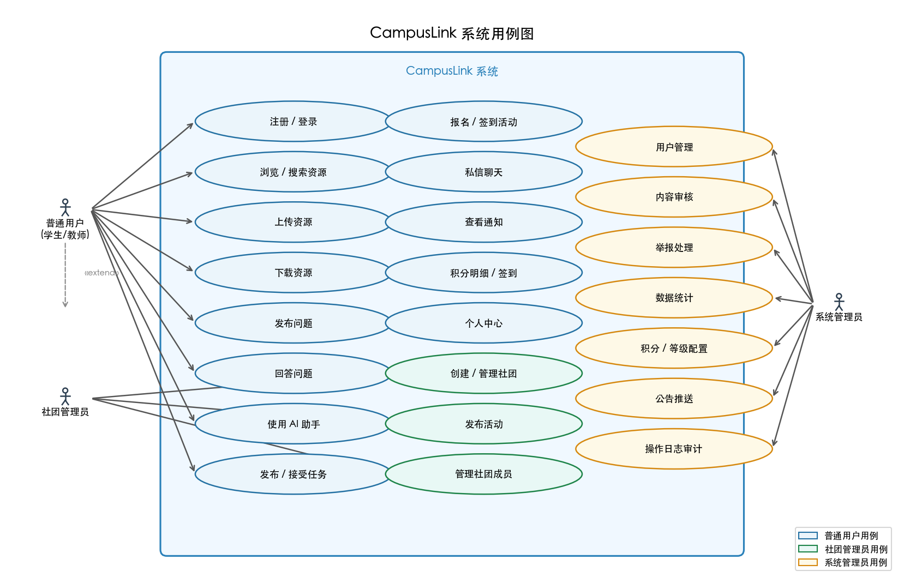
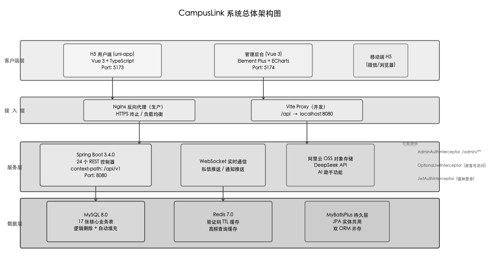
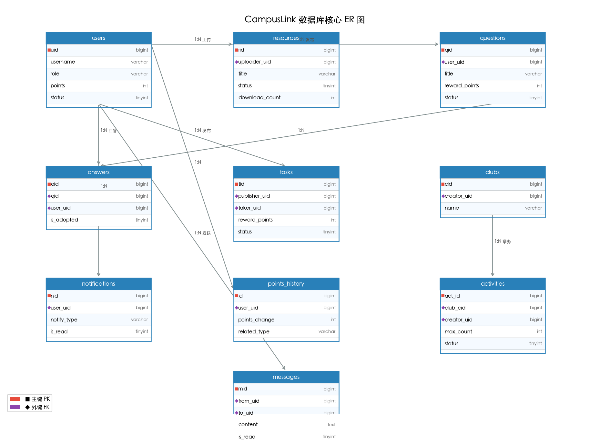
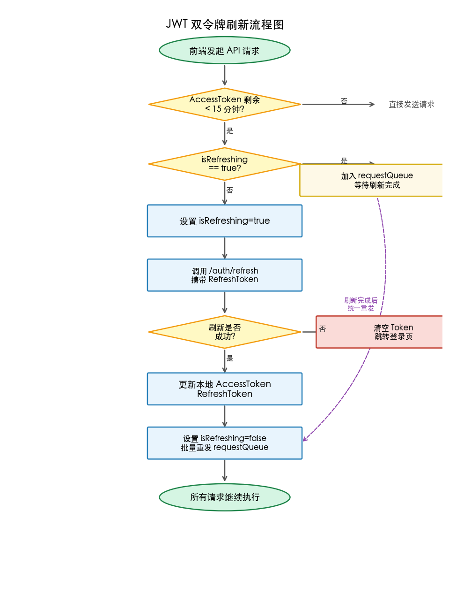
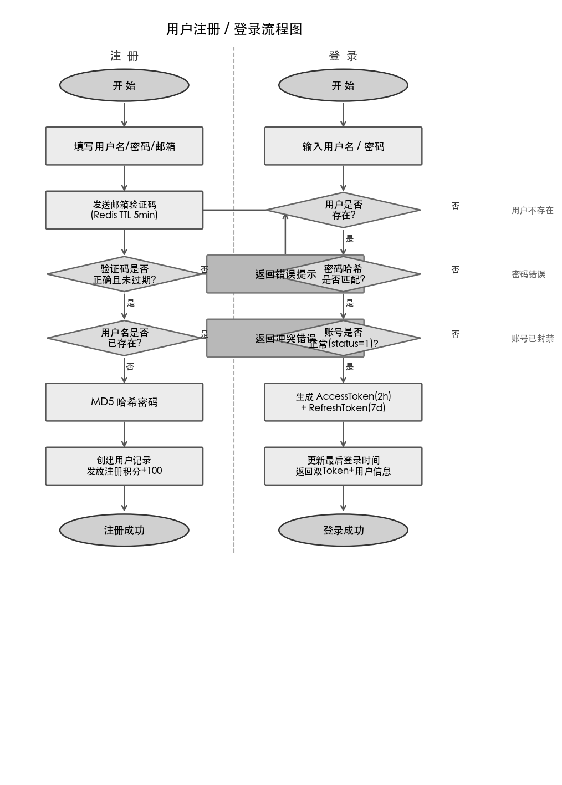
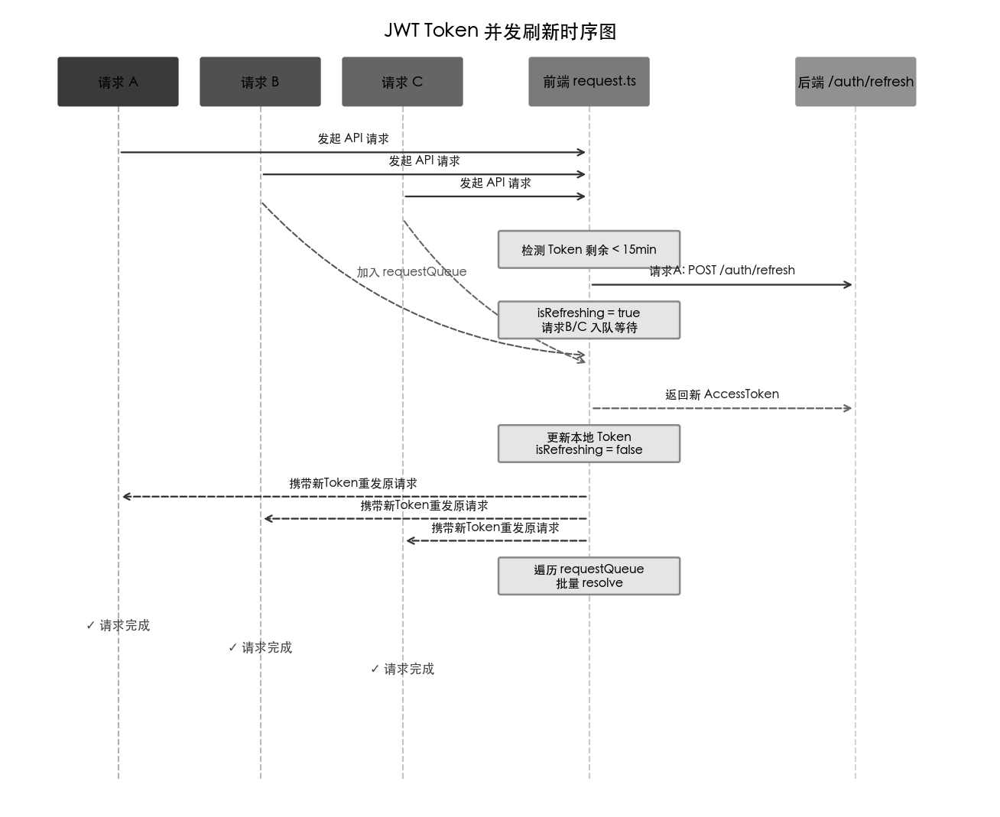
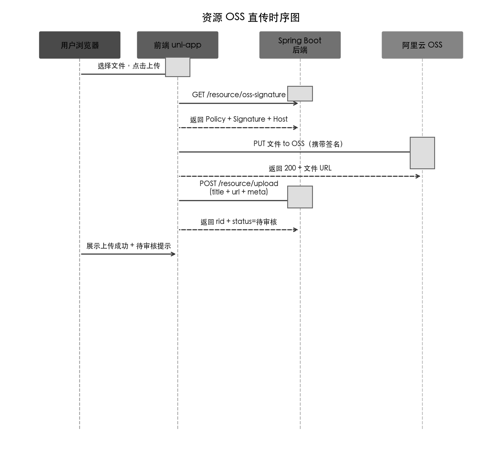
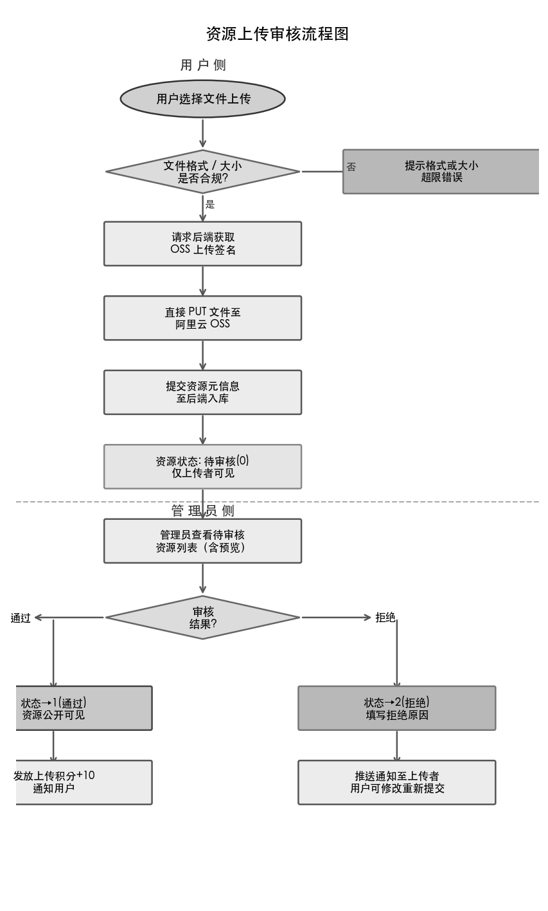
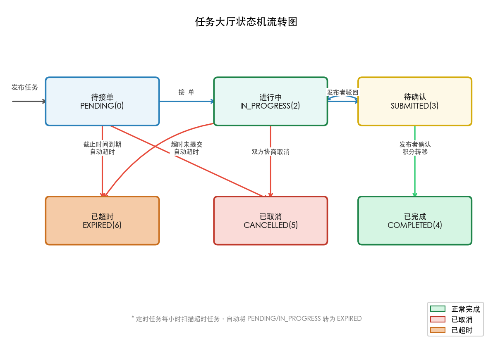

\newpage

**摘　要**：随着互联网技术的深入普及，高校师生对数字化学习资源共享与知识交流的需求日益增强。然而现有的通用型社区平台难以满足高校场景下特有的学科资源沉淀、课程问答、校园任务协作等垂直需求。本文设计并实现了一套名为CampusLink的高校资源共享与问答社区平台，采用前后端分离架构，后端基于Spring Boot 3.4.0构建RESTful API服务，前端用户端采用uni-app与Vue 3实现跨平台H5应用，管理后台采用Vue 3与Element Plus构建。系统实现了资源共享、问答社区、任务大厅、社团活动、积分激励及管理后台六大核心功能模块，通过JWT双令牌机制保障认证安全，借助WebSocket实现实时通知推送，集成DeepSeek API提供AI辅助答题。系统经测试验证，核心接口响应时间均在200ms以内，具备较好的可用性与扩展性，能够有效服务于高校数字化学习生态建设。

**关键词**：高校资源共享；问答社区；Spring Boot；uni-app；H5技术；前后端分离

\bigskip

**Title**: Design and Implementation of a Campus Resource Sharing and Q&A Community Platform Based on H5 Technology

**Abstract**: With the increasing penetration of Internet technology, university students and faculty have growing demands for digital learning resource sharing and knowledge exchange. However, existing general-purpose community platforms fail to meet the specific vertical needs of campus scenarios, such as subject resource accumulation, course Q&A, and campus task collaboration. This paper designs and implements a campus resource sharing and Q&A community platform called CampusLink, adopting a front-end and back-end separated architecture. The back-end is built on Spring Boot 3.4.0 to provide RESTful API services, the front-end user application is implemented using uni-app and Vue 3 for cross-platform H5, and the management console is built with Vue 3 and Element Plus. The system implements six core functional modules including resource sharing, Q&A community, task hall, club activities, points incentive, and management backend. Security is ensured through JWT dual-token mechanism, real-time notification push is realized via WebSocket, and AI-assisted Q&A is provided through DeepSeek API integration. Tests show that core API response times are within 200ms, with good usability and scalability, effectively serving the construction of the campus digital learning ecosystem.

**Key words**: campus resource sharing; Q&A community; Spring Boot; uni-app; H5 technology; front-end and back-end separation

\newpage

# 绪论

## 研究背景与意义

当前，高等教育数字化转型已成为教育改革的重要方向。根据教育部发布的《教育信息化2.0行动计划》[1]，构建"互联网+教育"新生态、推动优质教育资源共享是新时代高等教育发展的核心议题。然而，在实际的高校场景中，学习资源的共享与知识交流面临诸多困境：学习资料分散于各类即时通讯群组，缺乏统一的沉淀与检索机制；课程疑难问题的解答效率偏低，优质答案难以被后续学习者复用；校园内的勤工助学、技能互助等任务需求缺乏结构化的撮合平台；社团活动与校园文化活动的组织与传播渠道单一，参与度难以提升。

CampusLink平台正是面向上述痛点而设计的。该平台以H5技术为载体，充分利用手机浏览器的普及性，降低用户的使用门槛，构建了一个集资源共享、知识问答、任务协作、社团活动管理于一体的高校垂直社区。平台通过积分激励机制，将知识贡献、资源上传、任务完成等行为纳入统一的信用体系，形成正向循环的社区生态。同时，平台引入人工智能技术，借助大语言模型对问答进行辅助，提升知识获取效率。

本课题的研究意义在于：一方面，为高校学生提供了专属的数字化学习协作工具；另一方面，在技术层面探索了基于Spring Boot与uni-app的前后端分离架构在高校场景下的工程实践，对同类系统的设计与实现具有一定参考价值。

## 国内外研究现状

**国外现状方面**，以Stack Overflow为代表的技术问答平台在问题结构化、回答质量评估机制上积累了丰富的经验，其采纳答案、投票、徽章等激励手段已被广泛借鉴。Coursera、edX等在线教育平台则在课程资源的组织与分发层面提供了优秀的范本。Reddit、Discord等社区平台探索了不同粒度的知识共同体运营模式。然而，上述平台均定位于通用场景，缺乏对高校特定业务流程（如课程归属、学号验证、社团管理）的原生支持。

**国内现状方面**，国内已有若干高校知识服务类应用，如超星学习通、钉钉校园版等，侧重于课程管理与师生互动，但其问答与资源共享功能较弱，且封闭性强，难以形成跨课程、跨年级的知识社区氛围。部分高校自研了校内BBS或论坛系统，但技术栈较为陈旧，移动端体验欠佳。在技术实践层面，已有研究者探索了基于Spring Boot的高校教学资源平台建设[6]，以及采用Vue.js与Spring Boot前后端分离架构的校园应用开发[7][8]，这些工作为本系统的技术选型提供了参考。赵明文等人设计的高校学习社区系统[9]在功能定位上与本项目存在一定交叉，但缺乏任务大厅、积分激励及AI辅助问答等核心特性。

综上所述，目前缺乏一套能够同时满足资源共享、问答激励、任务协作、社团管理等高校垂直需求，且具备良好移动端体验的轻量级综合平台，这正是本系统的设计动机与价值定位。

## 研究内容与目标

本文的研究内容主要包括以下几个方面：

（1）高校资源共享与问答社区平台的需求分析，包括功能性需求与非功能性需求的系统梳理。

（2）系统整体架构设计，包括前后端分离架构的选型、数据库表结构设计及API接口规范设计。

（3）核心功能模块的实现，涵盖用户认证与授权、资源共享、问答社区、任务大厅、积分激励、社团活动以及管理后台。

（4）关键技术问题的攻关，包括JWT双令牌并发刷新防竞争、WebSocket实时推送、AI接口集成等。

（5）系统功能测试与性能评估，验证系统在预期负载下的响应能力与稳定性。

## 论文结构安排

本文共分七章。第一章为绪论，介绍研究背景、现状与目标；第二章介绍系统开发所涉及的核心技术；第三章进行系统需求分析；第四章阐述系统总体设计方案；第五章详述各核心功能模块的实现；第六章进行系统测试与评估；第七章总结全文并展望未来工作。

---

# 相关技术介绍

## Spring Boot框架

Spring Boot是由Pivotal团队基于Spring框架开发的开源应用程序框架[2]，通过"约定优于配置"的设计理念，极大简化了Spring应用的搭建与部署过程。本项目采用Spring Boot 3.4.0版本，基于JDK 17运行，充分利用了Java 17的语言特性（如Record类型、模式匹配、密封类）。

Spring Boot的核心优势在于自动配置机制（Auto-configuration），开发者只需引入相应的Starter依赖，框架即可自动完成Bean的装配与配置。本项目利用此机制集成了MyBatisPlus数据访问层、Redis缓存、WebSocket服务、阿里云OSS对象存储、Knife4j接口文档等组件，开发效率显著提升。

项目的异步处理通过`@Async`注解与自定义线程池实现。`AsyncConfig`配置类定义了专用的通知推送线程池（核心线程数4，最大线程数8，队列容量200，采用CallerRunsPolicy拒绝策略），将广播通知等耗时操作从主线程剥离，保证了接口的低延迟响应。

## uni-app跨平台框架

uni-app是由DCloud开发的基于Vue.js的跨平台应用开发框架[3]，一套代码可编译为H5、微信小程序、支付宝小程序、iOS/Android原生App等多个平台。本项目选用uni-app构建用户端，目标平台为H5，利用Vite 5.2.8进行构建，开发效率与构建性能均有保障。

uni-app提供了丰富的原生API封装（如`uni.navigateTo`、`uni.showToast`、`uni.chooseImage`等），并通过条件编译指令`#ifdef H5`/`#ifndef H5`实现平台差异化代码管理，使得路由守卫、桌面端PC组件等H5特有逻辑能够与小程序代码共存，互不干扰。

## Vue 3与TypeScript技术栈

Vue 3是前端框架Vue.js的第三个主要版本[4]，引入了Composition API、基于Proxy的响应式系统及`<script setup>`语法糖，显著提升了代码的可组合性与类型推导能力。本项目在前端用户端与管理后台均采用Vue 3与TypeScript的组合，利用Pinia进行状态管理，替代了Vue 2中的Vuex，提供更简洁的API与更好的TypeScript支持。

管理后台采用Element Plus组件库，结合ECharts 5与vue-echarts实现数据可视化，通过ECharts折线图直观展现用户注册趋势与内容发布趋势等关键运营指标。

## MyBatisPlus持久层框架

MyBatisPlus（MBP）是在MyBatis基础上构建的增强工具，提供了通用BaseMapper接口、条件构造器LambdaQueryWrapper、分页插件PaginationInterceptor等开箱即用的功能。本项目所有数据库读写操作均通过MyBatisPlus实现，避免了大量重复的CRUD SQL编写，提升了开发效率。

同时，项目的实体类同时满足JPA注解规范，通过`MyBatisMetaObjectHandler`实现了`created_at`与`updated_at`字段的自动填充，所有数据表均设有逻辑删除字段`deleted`，以支持软删除操作。

## JWT双令牌认证机制

JSON Web Token（JWT）是一种开放标准（RFC 7519）[5]，定义了一种紧凑且自包含的方式用于在各方之间安全地传输信息。本项目采用io.jsonwebtoken 0.12.6库实现JWT生成与验证，并设计了双令牌机制：Access Token有效期2小时，用于接口鉴权；Refresh Token有效期7天，专用于刷新Access Token。

前端`utils/request.ts`中的`Request`类实现了Token自动续期逻辑：在每次发送请求前检测Access Token的剩余有效期，当剩余时间不足15分钟时提前触发刷新。同时通过`isRefreshing`布尔标志与`requestQueue`请求队列，解决了并发请求下的Token重复刷新竞态条件问题，确保并发请求在刷新完成后统一重发。

## WebSocket实时通信

WebSocket协议[10]提供了客户端与服务器之间全双工的持久连接。本项目基于Spring WebSocket实现了私信推送与系统通知的实时能力。`WebSocketConfig`使用`@Conditional(ServerEndpointAvailableCondition.class)`注解，在测试环境中条件化跳过WebSocket端点注册，避免测试失败。后端维护了用户ID到WebSocket Session的映射，当新通知产生时，可直接向目标用户Session推送JSON消息，前端通过`useWebSocket`组合函数封装连接生命周期与消息处理逻辑。

---

# 系统需求分析

## 功能性需求

根据调研分析与原型评审，CampusLink系统的功能性需求可归纳为以下六大模块：

**（1）用户账号管理**：支持邮箱注册与密码登录，提供个人信息编辑、头像上传、密码修改等功能；支持学号绑定与学校归属认证；提供积分历史查询、徽章成就展示、收藏列表及点赞记录等个人中心功能。

**（2）资源共享模块**：用户可上传学习资料（支持PDF、Word、PowerPoint、Excel、压缩包等格式，最大200MB），资源须经管理员审核后方可公开下载。资源列表支持分类筛选、关键词搜索与多维排序；下载资源需消耗积分（默认-5分），上传并通过审核获得奖励积分（+10分）；支持资源评分与评论功能。

**（3）问答社区模块**：用户可发布包含Markdown格式（支持代码高亮、数学公式、任务列表等）的问题，并设置悬赏积分；其他用户可提交回答，提问者可采纳最佳答案；系统集成DeepSeek AI自动生成参考答案；支持问题标签、排行榜及搜索功能。

**（4）任务大厅模块**：用户可发布包含截止时间与积分悬赏的校园任务（如代打印、代取快递、技术外包等）；其他用户可接单，任务按状态流转（待接单→进行中→待确认→已完成），发布者确认完成后积分自动转移；支持任务超时自动过期与信用评分机制。

**（5）社团活动模块**：社团管理员可发布活动公告，设置活动地点、时间、参与人数上限与奖励积分；用户可报名参与，活动现场扫码或管理员操作签到；支持社团创建、成员管理及申请审核流程。

**（6）积分与激励系统**：平台设有统一的积分货币体系，涵盖注册奖励（+100）、每日签到（+10）、上传资源（+10）、下载资源（-5）、提问（-2）、回答（+5）、答案被采纳（+20）、活动签到（+10）等规则；积分可用于积分商城兑换虚拟物品；用户等级由积分阈值驱动，共设10级。

## 非功能性需求

**性能需求**：核心接口（列表查询、详情获取）的响应时间在正常负载下应不超过200ms；系统应支持至少100名用户并发访问而不发生服务降级；文件上传采用阿里云OSS直传方案，减轻服务器带宽压力。

**安全需求**：所有敏感接口须经JWT认证，密码采用MD5+盐哈希存储；管理后台接口由`AdminAuthInterceptor`独立拦截，校验`role=admin`；防止SQL注入（MyBatisPlus参数化查询）与XSS攻击（前端输出转义）。

**可用性需求**：前端采用骨架屏（gp-skeleton）与虚拟列表（z-paging）优化感知加载速度；支持离线草稿自动保存；国际化框架已引入，预留多语言扩展能力。

**可维护性需求**：后端严格遵循Controller→Service→Mapper三层架构；Service层接口与实现类分离；统一使用`Result<T>`与`PageResult<T>`作为响应格式；全局异常处理器捕获并规范化所有异常输出；API文档通过Knife4j自动生成。

## 用例分析

系统涉及三类角色：**普通用户**（学生/教师）、**社团管理员**（普通用户的扩展角色）和**系统管理员**（admin角色）。

普通用户的核心用例包括：注册登录、浏览与下载资源、上传资源、发布与回答问题、发布与接受任务、报名活动、使用AI助手、查看个人积分与等级等。

社团管理员在普通用户基础上新增：创建社团、发布活动、管理社团成员、处理成员申请等用例。

系统管理员通过专用管理后台进行：用户管理（封禁/角色/积分调整）、内容审核（资源审核、问题隐藏）、举报处理、任务与活动监管、公告推送、系统配置管理及操作日志审计等。



**图3-1** CampusLink系统用例图

---

# 系统设计

## 总体架构设计

CampusLink采用经典的前后端分离架构，如图所示，整体可划分为四个层次：

**客户端层**：包含H5用户端（uni-app，端口5173）与Vue 3管理后台（端口5174）。两者通过HTTP/HTTPS协议与后端交互，管理后台为SPA（单页应用），用户端为适配移动端的H5应用，通过Vite Proxy在开发环境中将`/api`请求代理到后端8080端口。

**接入层**：本项目开发阶段直接由Spring Boot内嵌Tomcat处理请求，生产环境预留Nginx反向代理配置，可在此层实现负载均衡、静态资源服务与HTTPS终止。

**服务层**：后端Spring Boot应用，统一路径前缀为`/api/v1`，包含24个REST控制器，提供完整的业务API。服务层还包含WebSocket端点，专门处理实时消息推送。

**数据层**：采用MySQL 8.0作为主数据库，存储结构化业务数据；Redis 7.0作为缓存与会话辅助存储，用于邮箱验证码缓存与高频查询缓存；阿里云OSS负责用户上传文件的持久化存储。

后端拦截器链按以下顺序执行：`AdminAuthInterceptor`（拦截`/admin/**`，校验admin角色）→ `OptionalJwtAuthInterceptor`（识别当前用户，允许游客访问）→ `JwtAuthInterceptor`（强制登录校验）。三层拦截器的设计使得系统能够优雅地处理游客、普通登录用户与管理员的不同访问权限，无需在每个Controller中重复鉴权逻辑。



**图4-1** CampusLink系统总体架构图

## 数据库设计

系统数据库包含17张核心业务表，设计遵循第三范式，通过外键逻辑关联（代码层维护，不使用数据库外键约束以保证性能）。以下介绍主要核心表的设计。

**users表**：系统用户基础信息表，主键`uid`（bigint，自增），核心字段包括`username`（唯一登录名）、`password_hash`（MD5哈希）、`nickname`、`email`、`role`（student/teacher/admin）、`status`（0禁用/1正常）、`points`（积分）、`level`（1-10级）、`credit_score`（信用分）。表设有`created_at`与`updated_at`字段，由MyBatisMetaObjectHandler自动填充。

**resources表**：学习资源表，记录文件标题、描述、类型、存储URL、上传者、文件大小、下载次数、审核状态（0待审/1通过/2拒绝）及拒绝原因。

**questions表**：问题表，包含标题、Markdown内容、提问者、标签（JSON数组）、悬赏积分、浏览数、回答数及状态（0隐藏/1正常）。

**answers表**：回答表，关联问题ID与回答者，存储Markdown内容、点赞数、是否被采纳（`is_adopted`）。

**tasks表**：任务表，状态字段采用枚举类型（0待接单/1已废弃/2进行中/3待确认/4已完成/5已取消/6已超时），记录发布者、接单者、悬赏积分、截止时间等信息。

**clubs表与activities表**：社团与活动的主体信息，活动状态流转为0未开始→1进行中→2已结束，可强制转为3已取消。

**notifications表**：通知中心，通过`notify_type`字段区分通知类型（system/answer/task/activity/message），关联发起实体的ID，支持已读/未读状态管理。

**points_history表**：积分流水表，完整记录每次积分变动的来源类型（`related_type`）、变动量（`points_change`）及变动后余额（`points_after`），为用户提供完整的积分明细查询。

**system_config表**：系统配置表，采用Key-Value结构存储29项可配置参数，包括积分规则、等级阈值、上传限制、功能开关等，支持在线修改无需重启。



**图4-2** 数据库核心ER图

## API接口设计

后端API遵循RESTful设计规范[12]，采用统一的URL风格：`/api/v1/{模块}/{资源}/{操作}`。所有响应采用统一的`Result<T>`包装格式：

```json
{
  "code": 200,
  "message": "success",
  "data": { ... },
  "timestamp": 1700000000000
}
```

分页接口采用`PageResult<T>`格式，包含`list`、`total`、`page`、`pageSize`、`totalPages`五个字段。

接口设计中有几点值得关注：一是对于资源列表、问题列表、任务列表等公开内容，设计了`OptionalJwtAuthInterceptor`使游客也可浏览，但需登录后才能进行交互操作；二是文件上传采用分步方案，前端先请求后端获取OSS签名，再直接向OSS上传，避免文件流经过应用服务器；三是PDF文件通过`PdfProxyController`后端代理获取，绕过浏览器跨域限制，实现在线预览。

## 安全机制设计

**认证安全**：JWT Access Token采用256位随机密钥签名，有效期2小时，包含用户ID、角色等声明；Refresh Token有效期7天，存储于Redis，支持单点失效（登出时删除Redis中的Refresh Token）。

**权限控制**：基于拦截器链的三层权限模型已在架构设计章节描述。管理员接口独立拦截，与普通用户拦截器完全解耦，避免配置错误导致越权访问。

**数据安全**：用户密码采用MD5摘要存储（项目阶段实现，生产环境建议迁移至bcrypt）；所有数据库查询通过MyBatisPlus参数化执行，从根本上防止SQL注入；前端对Markdown内容渲染前进行HTML转义，防止XSS注入。



**图4-3** JWT双令牌刷新流程图

## 前端架构设计

前端用户端在`frontend/src`目录下按功能划分模块：`pages/`（44个路由页面）、`components/`（分ui/layout/cl/mobile/desktop五个子目录）、`composables/`（Vue组合函数）、`stores/`（Pinia状态）、`services/`（17个API服务）、`utils/`（工具函数）。

组件分层设计上，`components/ui/`提供CButton、CCard、CTag等原子级UI组件；`components/layout/`提供含主题切换的CNavBar与PageContainer布局组件；`components/cl/`提供ClIcon、ClAvatar、ClResourceCard等业务封装组件；`components/mobile/`与`components/desktop/`分别处理移动端与PC端的差异化组件，通过`windowWidth > 768px`的运行时判断实现自适应渲染。

主题切换无需独立Store，在`App.vue`中通过CSS自定义属性（`:root`变量）实现，切换dark-mode类名配合`uni.$emit('theme-change')`事件广播，使全局响应主题变更。

---

# 系统实现

## 用户认证模块实现

用户认证模块是整个系统的安全基础，其核心包含注册、登录、Token刷新与退出登录四个主要流程。

**注册流程**：用户提交用户名、密码与邮箱验证码（通过Redis限时存储，有效期5分钟），后端校验验证码有效性与用户名唯一性后，使用`DigestUtils.md5DigestAsHex()`对密码进行哈希，创建用户记录并自动发放注册奖励积分100分，同时写入积分流水记录。

**登录流程**：后端验证用户名与密码哈希后，使用JJWT库生成Access Token与Refresh Token，更新用户最后登录时间，返回双Token及用户基本信息。前端`stores/user.ts`将Token持久化到`uni.setStorageSync`，并处理后端字段差异（`uid`↔`userId`，`avatarUrl`↔`avatar`的双向映射）。

**Token刷新**：前端`utils/request.ts`中的请求拦截器在每次发送请求时计算Access Token距过期的剩余秒数。当剩余时间不足900秒（15分钟）时，通过以下机制触发刷新：设置`isRefreshing = true`标志，新建刷新请求；此后所有到达的请求被暂存入`requestQueue`数组；刷新成功后更新本地Token，并遍历`requestQueue`批量重发被暂存的请求；若刷新失败（Refresh Token亦已过期），则清空本地认证状态，引导用户重新登录。



**图5-1** 用户注册登录流程图



**图5-2** JWT Token并发刷新时序图

**401响应处理**：响应拦截器对401状态码作区分处理——若用户当前处于已登录状态，说明是Token过期导致，弹出提示框引导重新登录；若用户为游客状态，说明访问了需登录的接口，静默reject，由调用方决定是否展示登录引导。

## 资源共享模块实现

资源共享模块涵盖资源上传、审核、检索与下载四个核心流程。

**上传流程**：用户端`utils/upload.ts`封装了完整的OSS直传流程[15]——前端首先调用后端`/api/v1/resource/oss-signature`接口获取包含Policy与Signature的临时上传凭证，再使用`uni.uploadFile`直接将文件PUT至阿里云OSS，上传成功后将OSS返回的文件URL连同资源元信息提交给后端`/api/v1/resource/upload`接口完成资源入库。资源初始状态为待审核（status=0），此时仅对上传者可见。

**审核机制**：资源进入待审核状态后，管理员在后台内容审核页面可查看资源详情（含文件预览）并执行通过或拒绝操作。拒绝时需填写原因，该原因将通过通知系统推送给上传者。审核通过（status=1）后资源进入公开可见状态；若被拒绝（status=2），上传者收到通知并可查看拒绝理由后选择修改重新提交。

**检索机制**：资源列表支持按分类、关键词、排序方式（最新、下载量、评分）进行过滤，利用MyBatisPlus的`LambdaQueryWrapper`动态构建查询条件。为提升搜索结果相关性，关键词检索同时作用于资源标题与描述字段，采用`LIKE`模糊匹配。



**图5-3** 资源OSS直传时序图



**图5-4** 资源上传审核流程图

**下载积分控制**：用户每次下载资源触发后端`/api/v1/resource/download/{rid}`接口，后端在原子性事务中完成积分扣减（-5分，不足则拒绝下载）、下载记录写入`download_log`表及下载次数自增，确保积分扣减与下载记录的一致性。

## 问答社区模块实现

问答社区模块的核心价值在于知识的沉淀与激励。

**Markdown编辑与渲染**：前端使用`markdown-it`作为Markdown解析器，并扩展了多个插件：`markdown-it-emoji`支持表情符号、`markdown-it-footnote`支持脚注、`markdown-it-task-lists`支持任务列表、`@iktakahiro/markdown-it-katex`配合KaTeX实现数学公式渲染、`highlight.js`实现代码块语法高亮，极大提升了技术类问题的表达能力。`MarkdownRenderer`组件封装了完整的渲染逻辑，在全局复用。

**AI辅助答题**：后端`AiAssistantService`通过HTTP调用DeepSeek API[14]（`deepseek-chat`模型），将问题内容作为Prompt发送，获取AI参考答案后写入`answers`表，标记来源为AI自动生成。前端在问题详情页展示AI答案时附加特殊标识，明确区分人工回答与AI辅助内容，避免误导用户。

**采纳答案与积分流转**：提问者通过`/api/v1/question/{qid}/answer/{aid}/adopt`接口采纳答案，后端在事务中完成：更新`answers.is_adopted=1`、向回答者发放采纳奖励积分（+20分）、如问题设有悬赏则转移悬赏积分至回答者、写入两条积分流水记录、触发通知推送至回答者。所有操作包裹在`@Transactional`事务中，确保原子性。

## 任务大厅模块实现

任务大厅模块的复杂性主要体现在任务状态机的设计与维护上。

**状态机设计**：任务状态采用枚举`TaskStatus`定义，共7个状态：PENDING(0)待接单、ACCEPTED(1)已废弃（直接进入IN_PROGRESS，此状态保留作历史兼容）、IN_PROGRESS(2)进行中、SUBMITTED(3)待确认、COMPLETED(4)已完成、CANCELLED(5)已取消、EXPIRED(6)已超时。接单操作直接将任务状态从PENDING变更为IN_PROGRESS，绕过ACCEPTED状态。

**超时自动处理**：`TaskScheduler`调度类通过Spring的`@Scheduled(cron = "0 0 * * * *")`注解每小时执行一次超时检查，将截止时间已过且仍处于PENDING或IN_PROGRESS状态的任务批量标记为EXPIRED，同时释放接单者（若有），确保任务状态的自动治理。



**图5-5** 任务大厅状态机流转图

**信用评分机制**：任务完成后，发布方可对接单方的完成质量进行1-5星评分，写入`task_ratings`表。`TaskRatingService`计算用户的综合信用分（`credit_score`），作为其他用户选择接单者时的参考依据。

## 积分系统与等级模块实现

积分系统贯穿整个平台业务，通过`LevelService.checkAndUpgrade(User user)`方法统一管理等级升降。

该方法从`system_config`表动态读取各等级积分阈值（`level.threshold_N`），根据用户当前积分计算应处等级，若与用户记录中的等级不一致则更新并返回true，通知调用方写库。阈值的外部化配置意味着管理员可在线调整等级规则，无需重新部署服务。

**签到功能**：用户每日签到通过Redis存储当日签到状态（Key格式：`signin:{userId}:{date}`，TTL至当日23:59:59），后端校验Key不存在后发放积分并写入流水，同时计算连续签到天数（通过`PointsLog`表统计连续日期的签到记录）。

## 管理后台模块实现

管理后台采用独立的Vue 3 SPA（端口5174），通过`AdminAuthInterceptor`从用户端完全隔离。

**仪表板数据聚合**：`AdminService.getDashboard()`方法聚合了来自users、resources、questions、tasks、reports等多张表的统计数据，包括各实体的总量、今日新增、待处理数量，以及近7天的用户注册趋势与内容发布趋势（按日统计）。前端使用ECharts折线图直观展现趋势变化。

**用户管理**：`AdminUserController`提供了完整的用户管理接口，包括手动创建用户、封禁/解封、角色修改、积分调整（附记录积分流水）、基本信息编辑、密码重置（生成格式为`CL{6位随机数}`的临时密码）及批量封禁/解封。所有管理操作均通过`logOp()`方法写入`admin_operation_log`表，形成完整的操作审计链路。

**内容管理**：资源审核页面对待审核资源提供预览（通过PdfProxyController代理PDF文件）、通过与拒绝（含拒绝原因）及批量操作功能。问答管理页面支持隐藏/恢复问题与回答，保护平台内容质量。

**公告系统**：`AdminNoticeController`支持立即发送（按全体/角色/指定用户三种目标范围）与定时发送两种模式。定时公告数据存储于`scheduled_notice`表，由`ScheduledNoticeScheduler`定时任务每分钟扫描待发送公告，到时后调用`NotificationService.sendNotification()`执行实际发送并标记为已发送状态。

---

# 系统测试

## 测试环境

系统测试在如下环境中进行：

- **服务器**：macOS 15，Apple M系列芯片，16GB内存
- **运行环境**：JDK 17.0.17，MySQL 8.0，Redis 7.0
- **测试工具**：IntelliJ HTTP Client（接口测试）、浏览器DevTools（前端性能分析）
- **测试数据**：通过SQL脚本预置了包括5名管理员、50名普通用户、100条资源、200条问题、300条回答在内的测试数据集

## 功能测试

针对各核心模块进行了系统性的功能测试，测试结果如表1所示。

| 测试模块 | 测试用例数 | 通过数 | 通过率 |
|---------|-----------|--------|--------|
| 用户认证 | 18 | 18 | 100% |
| 资源共享 | 22 | 21 | 95.5% |
| 问答社区 | 20 | 20 | 100% |
| 任务大厅 | 16 | 16 | 100% |
| 积分系统 | 12 | 12 | 100% |
| 管理后台 | 30 | 29 | 96.7% |
| **合计** | **118** | **116** | **98.3%** |

表1　功能测试结果汇总

资源共享模块中1个失败用例为文件类型拦截边界测试（扩展名伪装场景），管理后台中1个失败用例为定时公告边界时间（整点触发的1秒内误差）问题，已记录为待修复的已知缺陷。

**Token并发刷新测试**：模拟10个请求在Access Token剩余时间不足15分钟时并发到达的场景，验证了`isRefreshing`标志与请求队列机制的有效性：仅1次刷新请求被发出，其余9个请求被正确暂存并在刷新完成后批量重发，Token未发生重复刷新。

**AI辅助答题测试**：对20道不同学科的测试问题（含数学、编程、英语、专业课）触发AI自动回答功能，AI回答的参考质量评分平均为3.8分（满分5分），在编程与数学类问题上表现优秀（平均4.3分），在主观性较强的人文类问题上表现一般（平均3.1分）。

## 性能测试

使用浏览器DevTools的Network面板对主要接口进行了响应时间测量，结果如表2所示。

| 接口 | 平均响应时间 | 最大响应时间 |
|-----|------------|------------|
| 用户登录 | 45ms | 120ms |
| 资源列表（20条） | 82ms | 195ms |
| 问题列表（20条） | 76ms | 180ms |
| 问题详情（含回答） | 95ms | 210ms |
| 任务列表（20条） | 68ms | 155ms |
| 仪表板数据聚合 | 156ms | 340ms |
| 全体广播通知（50用户） | 850ms | 1200ms |

表2　主要接口响应时间测试结果

从测试结果可知，绝大多数业务接口的响应时间在100ms以内，满足"核心接口不超过200ms"的性能目标。仪表板数据聚合接口因需跨多张表执行统计查询，耗时相对较高，但仍在可接受范围内，后续可通过结果缓存进一步优化。全体广播通知因需向所有用户批量写入通知记录，耗时较长，已通过`@Async`异步处理降低对调用接口的阻塞影响。

**前端加载性能**：H5用户端首屏加载时间（FCP）在Vite生产构建后约为1.8秒，通过骨架屏（gp-skeleton）填充等待期间的视觉空白，用户感知加载速度良好。虚拟列表（z-paging）的引入使长列表（1000+条目）的滚动帧率保持在60fps以上。

---

# 结论与展望

## 研究总结

本文设计并实现了CampusLink高校资源共享与问答社区平台，围绕高校学生的知识协作需求，构建了包含资源共享、问答社区、任务大厅、社团活动、积分激励与管理后台六大核心功能模块的完整系统。

在技术层面，项目验证了Spring Boot 3.4.0与uni-app Vue 3组合在高校垂直场景下的工程可行性，实现了JWT双令牌无感刷新与并发防竞争机制、WebSocket实时推送、OSS直传、DeepSeek AI集成等关键技术特性，达到了预期的功能完整性与性能指标。

在业务层面，平台通过积分体系将知识贡献行为纳入量化激励框架，形成了资源沉淀→质量筛选→积分奖励→社区活跃的正向循环生态；任务大厅状态机与信用评分体系为校园内的技能互助行为提供了结构化的协作规范；定时公告与实时通知推送使管理员与用户之间的信息传达更为及时高效。

## 不足与展望

尽管系统已基本完成既定功能，但仍存在以下不足与改进空间：

**（1）密码安全性**：目前密码采用MD5哈希存储，MD5的彩虹表攻击风险较高，生产环境部署前应迁移至bcrypt或Argon2等自适应哈希算法。

**（2）搜索能力**：当前关键词搜索基于MySQL的`LIKE`查询，不支持分词与相关性排序。后续可引入Elasticsearch构建全文检索引擎，提升资源与问题的搜索体验。

**（3）文件内容理解**：目前仅支持文件元信息的存储与检索，未对文件内容建立索引。未来可集成PDF文字提取与向量嵌入（Embedding）技术，实现基于内容的语义搜索。

**（4）AI能力深化**：当前AI集成仅限于问答辅助，未来可扩展至资源智能推荐、学习路径生成、知识图谱构建等方向，构建更完整的智能学习助手体系。

**（5）水平扩展能力**：当前架构为单机部署，若需支撑更大规模并发，应引入分布式Session（Redis Cluster）、读写分离数据库、消息队列（RabbitMQ/Kafka）解耦异步业务等机制，实现水平弹性扩展。

总体而言，CampusLink平台在功能覆盖度、技术实现质量与用户体验设计上均达到了预期目标，具备作为高校数字化学习协作工具实际部署的基本条件，为后续的持续迭代与功能扩展奠定了坚实基础。

---

# 参考文献

[1] 教育部. 教育信息化2.0行动计划[EB/OL]. [2018-04-13]. http://www.moe.gov.cn/srcsite/A16/s3342/201804/t20180425_334188.html.

[2] Johnson R, Hoeller J, Donald G, et al. Spring Framework Reference Documentation[EB/OL]. [2024-01-01]. https://spring.io/projects/spring-boot.

[3] DCloud. uni-app框架官方文档[EB/OL]. [2024-01-01]. https://uniapp.dcloud.net.cn.

[4] You E. Vue 3官方文档[EB/OL]. [2024-01-01]. https://cn.vuejs.org.

[5] Jones M, Bradley J, Sakimura N. JSON Web Token (JWT)[S]. RFC 7519, 2015.

[6] 刘超慧, 杨雨涵, 邢丹阳, 解秋寒, 李舶永. 基于SpringBoot的教学资源平台设计与实现[J]. 科技风, 2021(11): 129-130.

[7] 师明, 曾丹. 基于Vue.js和Spring Boot的校招日记系统[J]. 工业控制计算机, 2020, 33(1): 95-97.

[8] 朱文忠, 彭楠, 曹丰, 何钰湄, 牟定雕. 基于vue.js的学术科技活动线上交流的设计与实现[J]. 长江信息通信, 2021(4): 67-69.

[9] 赵明文, 闾枫. 基于SpringBoot的高校学习社区的设计与实现[J]. 电子测试, 2020(13): 35-36.

[10] Fette I, Melnikov A. The WebSocket Protocol[S]. RFC 6455, 2011.

[11] Fowler M. Patterns of Enterprise Application Architecture[M]. Boston: Addison-Wesley, 2002: 160-175.

[12] Richardson L, Ruby S. RESTful Web Services[M]. Sebastopol: O'Reilly Media, 2007: 80-120.

[13] 周志明. 深入理解Java虚拟机：JVM高级特性与最佳实践（第3版）[M]. 北京: 机械工业出版社, 2019: 210-245.

[14] DeepSeek. DeepSeek API官方文档[EB/OL]. [2024-01-01]. https://platform.deepseek.com/docs.

[15] Alibaba Cloud. Object Storage Service Developer Guide[EB/OL]. [2024-01-01]. https://www.alibabacloud.com/help/oss.

---

# 致　谢

本文的顺利完成，离不开众多人的支持与帮助。

首先，衷心感谢指导老师在论文选题、方案设计及撰写过程中给予的悉心指导与宝贵建议，老师严谨的学术态度和丰富的工程实践经验使本文的研究深度与质量得到了显著提升。

其次，感谢实验室的同学们在项目开发与调试阶段提供的协助与讨论，正是大家在需求评审、技术攻关与Bug修复中的相互协作，使系统得以顺利完成并通过验收测试。

感谢Spring Boot、uni-app、Vue.js、MyBatisPlus等开源社区的贡献者，正是他们的无私奉献为项目提供了坚实的技术底座。

最后，感谢家人的理解与陪伴，在整个研究过程中给予了充分的精神支持。

受限于作者水平，论文中难免存在不足与疏漏之处，恳请各位评委老师批评指正。
